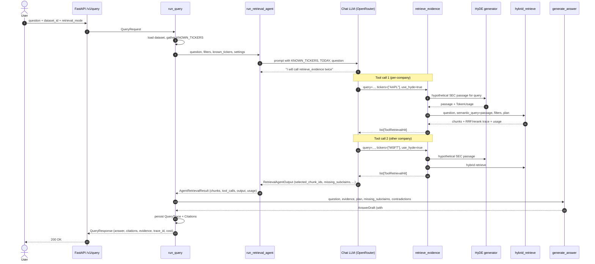
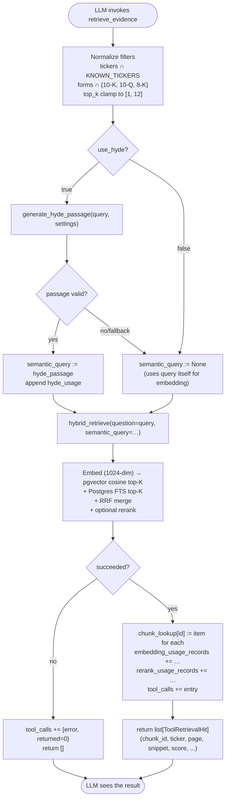
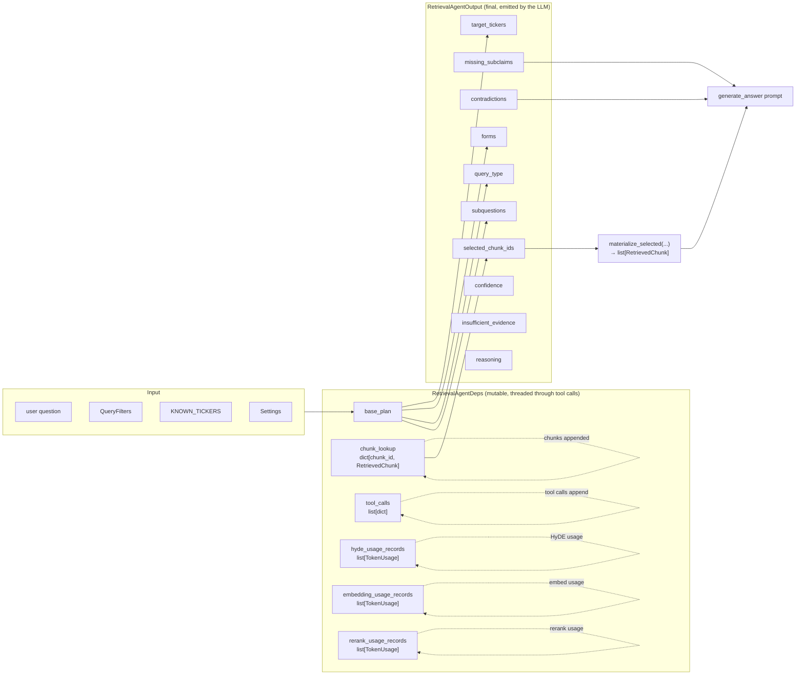
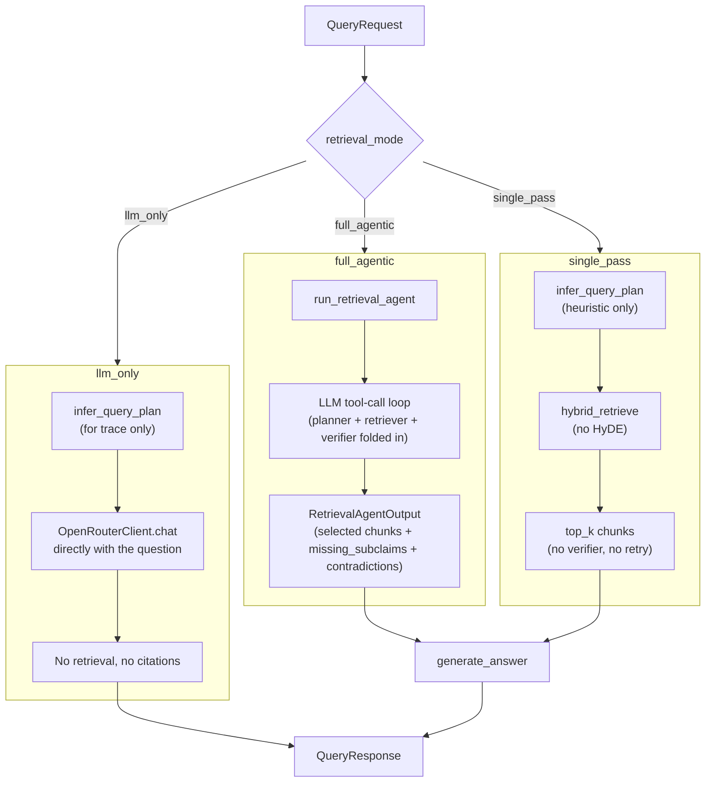
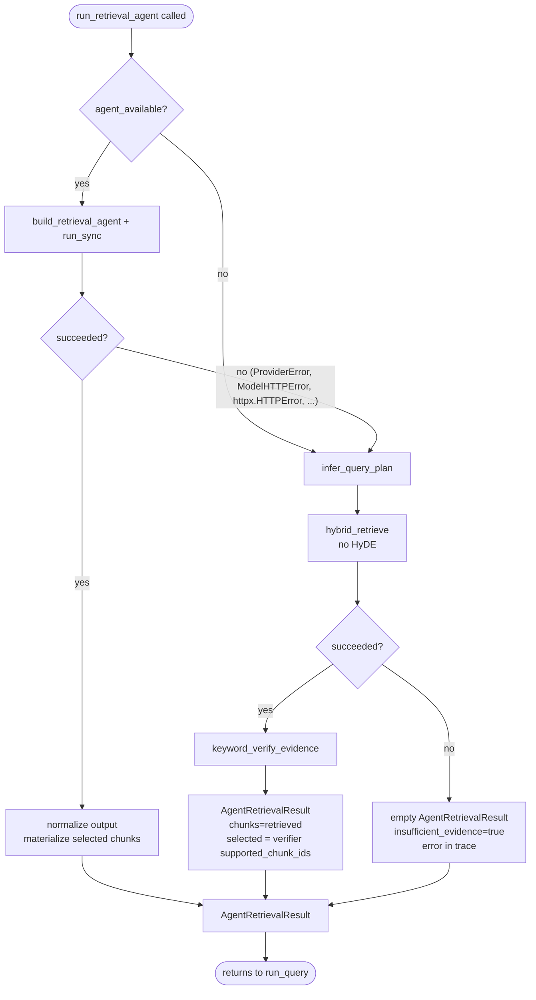

# Agentic Retrieval — A Walkthrough

This doc explains how `full_agentic` retrieval works in this codebase. It is meant to be
read top-to-bottom: motivation, request lifecycle, what happens inside the tool, how the
three retrieval modes compare, and what fails-over to what.

For the original architecture decision see
[`adr/0006-agentic-retrieval.md`](adr/0006-agentic-retrieval.md). For the broader system
design see [`system-design.md`](system-design.md).

---

## Why a Tool-Using Agent

The earlier design ran three sequential Pydantic AI agents — planner, verifier,
generator — each producing structured JSON. None of them used tools. Control flow
(when to retrieve, when to retry, what to filter) was hard-coded in `run_query`. In
practice:

- Subquestions were decorative — the planner emitted 2–5 of them, but retrieval ran
  once on the literal user question.
- The verifier's `retry_query` was the only adaptive behavior, and the retry reused
  the same plan filters.
- "Compare A vs B" queries got one mixed retrieval rather than balanced per-company
  coverage.

The `full_agentic` mode now collapses those three roles into one bounded **tool-using**
agent with one tool, `retrieve_evidence`. The agent decides how many times and with
what filters to call it, and emits a single structured output combining planner
metadata and verifier signals. The generator step downstream is unchanged.

Key files:

- [`backend/packages/rag-retrieval/rag_retrieval/retrieval_tool.py`](../backend/packages/rag-retrieval/rag_retrieval/retrieval_tool.py)
  — agent, tool, orchestrator, fallback
- [`backend/packages/rag-retrieval/rag_retrieval/hyde.py`](../backend/packages/rag-retrieval/rag_retrieval/hyde.py)
  — HyDE passage generator
- [`backend/packages/rag-retrieval/rag_retrieval/hybrid.py`](../backend/packages/rag-retrieval/rag_retrieval/hybrid.py)
  — RRF + pgvector + FTS + optional rerank (used by the tool and by `single_pass`)
- [`backend/packages/rag-retrieval/rag_retrieval/query.py`](../backend/packages/rag-retrieval/rag_retrieval/query.py)
  — `run_query` orchestrator that branches by `retrieval_mode`

---

## Request Lifecycle (`full_agentic`)

What happens when the API receives `POST /v1/query` with `retrieval_mode=full_agentic`.
The agent decides on its own how many tool calls to make; the diagram shows two as a
representative example.

Highlights:

- The orchestrator (`run_query`) only loads the dataset, gathers the known-tickers set
  once, and routes the result. It never decides what to retrieve.
- The agent makes **bounded** tool calls via Pydantic AI's `UsageLimits(request_limit=N+1)`
  where `N = retrieval_agent_tool_call_budget` (default 8). The `+1` budget extra leaves
  room for the final synthesis turn.
- The trace records each tool call plus its HyDE/embedding/rerank usage so cost can be
  attributed per call.

---

## Inside `retrieve_evidence`

What a single tool invocation does. The LLM passes named arguments via JSON; the tool
validates them, optionally runs HyDE, hybrid-retrieves, and updates run-scoped state
so the orchestrator can materialize chunk IDs back to full `RetrievedChunk` objects
after the agent emits its final output.

Key invariants:

- **Whitelisting is non-negotiable.** Unknown tickers are silently dropped inside the
  tool — the LLM cannot synthesize a ticker. Forms outside `{10-K, 10-Q, 8-K}` are also
  dropped. `top_k` is clamped server-side.
- **HyDE only steers the semantic probe.** FTS still uses the literal `query` so an
  exact-phrase / exact-number hit isn't lost to a vague hypothetical passage. The LLM
  can also turn HyDE off per call (`use_hyde=false`) when it knows the question is
  better matched lexically.
- **Tool failures degrade gracefully.** A `ProviderError` (or any exception) from
  `hybrid_retrieve` returns `[]` to the LLM with the error recorded in the trace. The
  LLM can retry with different filters or wording.

---

## Data Flow Through One Run

What state is carried between tool calls, and what comes out at the end.

The orchestrator (`run_retrieval_agent`) materializes the agent's `selected_chunk_ids`
back into `RetrievedChunk` objects by looking them up in `chunk_lookup`. If the agent
emits an empty `selected_chunk_ids` (it can forget to fill the field), the orchestrator
falls back to the top-scored chunks from `chunk_lookup` as a safety net.

---

## Three Retrieval Modes Side-By-Side

The `retrieval_mode` field on `QueryRequest` selects one of three paths. All three are
exercised by the eval runner so ablation comparisons are meaningful.

| Mode | Plans | Retrieves | Uses HyDE | Verifies | Cites | Use it for |
| --- | --- | --- | --- | --- | --- | --- |
| `full_agentic` | LLM agent (tool calls) | 1..N tool calls | per-call, LLM decides | absorbed into agent output | yes | Production answers; hard comparisons; sector synthesis |
| `single_pass` | Heuristic regex/keyword | exactly 1 | no | none | yes | Non-agentic baseline for ablations |
| `llm_only` | Heuristic (trace only) | none | n/a | n/a | no (intentional) | Ablation control: what does the LLM "know" without retrieval? |

---

## When the Agent Can't Run

`agent_available(settings)` is False when any of these holds:

- `ALLOW_MOCK_PROVIDERS=true` (local dev / CI / smoke tests)
- `OPENROUTER_API_KEY` is missing
- `OPENROUTER_CHAT_MODEL` is unset

In that case (or when the agent runs but raises any retryable error) the orchestrator
falls back to a single deterministic pass. The fallback wraps its result in the same
`AgentRetrievalResult` shape so callers don't have to branch.

The fallback path:

- Plans heuristically (regex tickers, keyword query_type).
- Runs **one** `hybrid_retrieve` (no HyDE).
- Verifies with `keyword_verify_evidence` (lexical overlap + semantic_rank fallback).
- Records a single synthetic tool-call entry in the trace so the schema is uniform.

This means a partially-degraded production environment (e.g., OpenRouter outage)
still returns grounded, cited answers — just less adaptively.

---

## Bounded Budget

Pydantic AI's `UsageLimits(request_limit=N)` caps how many model requests one run can
issue. Each tool result requires a new request (the LLM consumes the result and decides
what to do next), so the practical effect is:

- `request_limit = retrieval_agent_tool_call_budget + 1`
- The `+1` leaves room for the final synthesis turn that emits `RetrievalAgentOutput`.

Default: `retrieval_agent_tool_call_budget = 8`. Sized so the agent can fan out across
multi-part / cross-company queries (e.g. 6-company comparisons, multi-segment lookups)
without surprising costs. The earlier default of 4 unfairly capped the `full_agentic`
ablation against single_pass / llm_only when subclaim counts exceeded 4.

When the limit is hit, Pydantic AI raises `UsageLimitExceeded`, which `run_retrieval_agent`
catches via `AGENT_RETRYABLE_ERRORS` and falls back to the heuristic path.
In practice the system prompt nudges the agent to stay within budget; the runtime cap
is just a backstop.

---

## What Gets Persisted For Each Query

The trace shape is unchanged from before this refactor — `QueryTrace.plan`,
`retrieval_calls`, and `verifier_result` are JSON columns whose **content** changes
shape, not the column types. The frontend trace viewer continues to render them.

| Column | `full_agentic` content | `single_pass` content |
| --- | --- | --- |
| `plan` | Derived from agent output: `{target_tickers, forms, metrics, query_type, latest, subquestions, reasoning, ...}` | From heuristic planner: same shape but populated by regex/keyword inference |
| `retrieval_calls` | One entry per tool invocation: `{tool, query, semantic_query_preview, tickers, form_types, top_k, use_hyde, hyde_meta, retrieval_trace, returned}` | One entry: `{query, retrieval_trace}` |
| `verifier_result` | Derived from agent output: `{supported_chunk_ids=selected_chunk_ids, missing_subclaims, contradictions, retry_query=null, confidence, reasoning}` | Empty result (single_pass doesn't verify) |
| `model_metadata.usage_summary` | `RoleUsage`: agent's chat tokens + HyDE folded into `planner`; embedding + rerank tracked separately | `planner` from heuristic (empty), `embedding` + `rerank` from one hybrid call |
| `model_metadata.tool_call_count` | int — how many tool calls the agent made | n/a |

---

## Where To Look In The Code

If you're reading the system end-to-end, this is a useful order:

1. **`retrieval_tool.py`** — start at `run_retrieval_agent` (the orchestrator),
   then `build_retrieval_agent` (constructs the Pydantic AI `Agent` + registers the
   `@agent.tool retrieve_evidence` wrapper), then `perform_retrieve_evidence` (the
   testable tool body).
2. **`hyde.py`** — `generate_hyde_passage` is short; the system prompt explains the
   contract the LLM is asked to fulfill.
3. **`hybrid.py`** — `hybrid_retrieve` is the workhorse. Note the `semantic_query`
   parameter that lets the tool route HyDE text to the vector probe while keeping
   FTS on the literal query.
4. **`query.py`** — `run_query` branches on `retrieval_mode`. Walk the
   `full_agentic` branch end-to-end to see how the agent's output is converted into
   the trace's `plan` and `verifier_result` dicts.
5. **`generation.py`** — `_build_generator_prompt` now surfaces a "VERIFIER FLAGS"
   block when the agent reported `missing_subclaims` or `contradictions`, so the
   generator can hedge.

For tests that exercise the agent path without a live LLM:

- `tests/test_retrieval_agent.py` — `_FakeAgent` replays a scripted sequence of tool
  calls and final outputs. Useful template for trying out new strategies.
- `tests/test_retrieval_tool.py` — calls `perform_retrieve_evidence` directly. Useful
  for testing tool-level invariants (filter whitelist, top_k clamp, HyDE routing,
  error handling).
- `tests/test_hyde.py` — covers the four HyDE paths: kill switch, agent unavailable,
  successful generation, empty/exception fallback.
